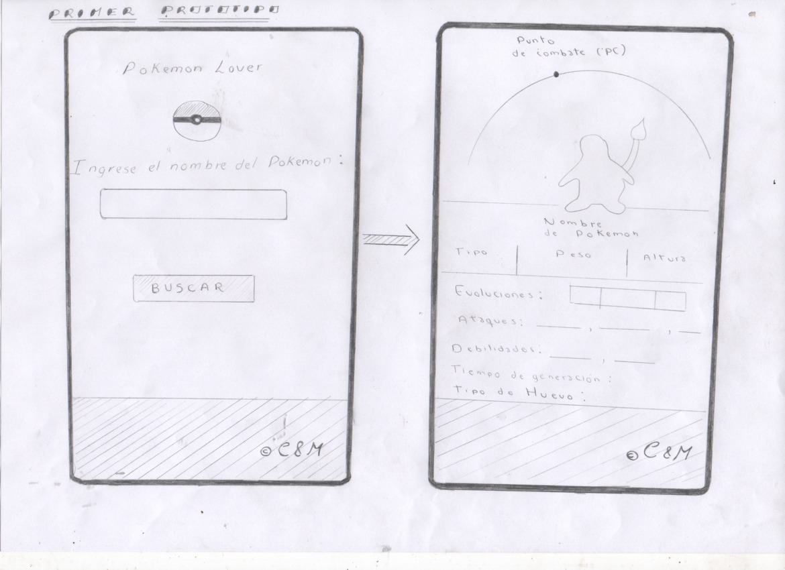
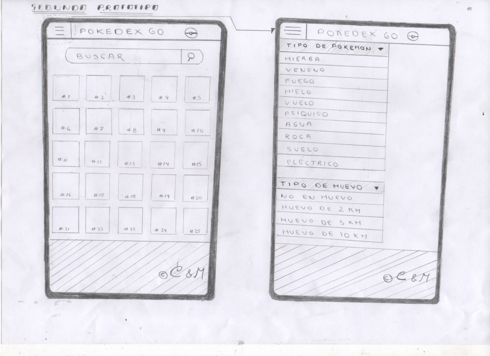
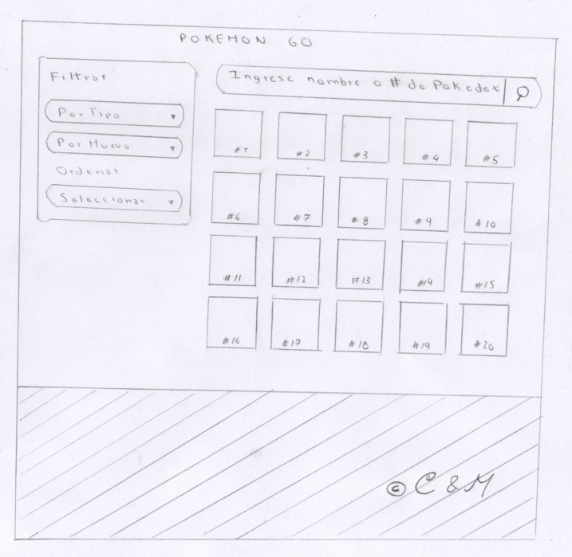

# POKEMON GO

## Índice

* [Definición del producto](#Definición-del-producto)
* [Historias de usuario](#Historias-de-usuario)
* [Prototipo de baja fidelidad o Sketch](#Prototipo-de-baja-fidelidad-o-Sketch)
* [Prototipo de alta fidelidad o Diseño de la interfaz de usuario](#Prototipo-de-alta-fidelidad-o-Diseño-de-la-interfaz-de-usuario)
* [Prototipo de alta fidelidad o Diseño de la interfaz de usuario](#Prototipo-de-alta-fidelidad-o-Diseño-de-la-interfaz-de-usuario)
* [Test de usabilidad](#Test-de-usabilidad)

***

## Definición del producto
1.	¿Quiénes son los principales usuarios del producto?
     Jugadores de Pokemon Go.

2.	¿Cuáles son los objetivos de estos usuarios?
     Acceder a información detallada, sobre los pokemones que se encuentran en Pokemon Go, o precisamente tener información sobre los pokemones que van capturando durante el juego.

3.	¿Cuáles son los datos más relevantes que quieren ver en la interfaz y porque?
-	Tipos de Pokemon
-	Que pokemones pueden obtener según el tipo de huevo
-	Orden de los pokemones según número de Pokedex.
-   Orden de los pokemones según orden alfabético de A-Z.
-   Orden de los pokemones según orden alfabético de Z-A.
-	Cantidad de  caramelos que necesita el Pokemon para evolucionar

4.	¿Cuándo utilizan o utilizarían el producto?
     Cuando quieren obtener información detallada de los pokemones del juego Pokemon Go.

5.	¿Cómo fue el proceso de diseño?
-    Se eligió, con que data ibamos a trabajar, en este caso elegimos la data de Pokemon.
-    Se eligió quienes serán los principales usuarios del producto, para ello se procedió a revisar qué información tenía      la data de Pokemon, cuando se revisó la data nos dimos cuenta que la información que tenía era sobre el juego             Pokemon Go en específico, por ello se decidió que nuestros usuarios serían los jugadores de Pokemon Go. 
-    Se realizaron entrevistas a las personas que sean Jugadores de Pokemon Go, antes de realizar la entrevista, se le         avisó a la persona que la entrevista sería grabada y que queríamos que nos explicara o nos hablara sobre qué              información le parece importante o necesaria encontrar en una página web sobre el juego Pokemon Go.
-    Según las grabaciones de las entrevistas se realizaron las Historias de Usuario.
-    Se realizaron los prototipos de baja fidelidad según las Historias de Usuario.
-    Se realizaron los prototipos de alta fidelidad, tomando en cuenta los prototipos de baja fidelidad.

6.	¿Cómo crees que el producto resuelve el problema que tiene tu usuario?

     El presente proyecto soluciona la necesidad del usuario de acceder fácilmente a informacion específica sobre los pokemones que se encuentran en el juego pokemonGo. 

## Historias de usuario

### Historia 1

COMO: Jugador de Pokemon Go

QUIERO: Filtrar los tipos de Pokemon

PARA: Saber que pokemones hay según el tipo.

CRITERIOS DE ACEPTACIÓN
- La página debe permitir filtrar a los pokemones según el tipo.
- La página debe mostrar a los pokemones según el tipo al que pertenezcan.
- El usuario debe poder seleccionar el tipo de pokemon que desea ver.
- Debe pasar Test unitario.
- Debe ser responsive.

### Historia 2

COMO: Jugador de Pokemon Go

QUIERO: Filtrar los pokemones según el tipo de huevo

PARA: Poder saber que pokemones puedo obtener según el tipo de huevo.

CRITERIOS DE ACEPTACIÓN
- La página debe permitir filtrar a los pokemones según el tipo de huevo.
- La página debe mostrar a los pokemones según el tipo de huevo al que pertenezcan.
- El usuario debe poder seleccionar el tipo de huevo que desea ver.
- Debe pasar Test unitario.
- Debe ser responsive.

### Historia 3

COMO: Jugador de Pokemon Go

QUIERO: Ordenar a los pokemones según su número de pokedex

PARA: Poder ubicar facilmente al pokemon del que quiero saber más sobre sus habilidades.

CRITERIOS DE ACEPTACIÓN
- La página debe permitir ordenar a los pokemones según el número de Pokedex.
- La página debe mostrar a los pokemones ordenados según el número de Pokedex.
- El usuario debe poder seleccionar la opción Ordenar a los pokemones según el número de Pokedex.
- Debe pasar Test unitario.
- Debe ser responsive.

### Historia 4

COMO: Jugador de Pokemon Go

QUIERO: Ordenar a los pokemones según el orden alfabético de la A-Z.

PARA: Poder ubicar facilmente al pokemon del que quiero saber más sobre sus habilidades.

CRITERIOS DE ACEPTACIÓN
- La página debe permitir ordenar a los pokemones según el orden alfabético de la A-Z.
- La página debe mostrar a los pokemones ordenados según el orden alfabético de la A-Z.
- El usuario debe poder seleccionar la opción Ordenar a los pokemones según el orden alfabético de la A-Z.
- Debe pasar Test unitario.
- Debe ser responsive.

### Historia 5

COMO: Jugador de Pokemon Go

QUIERO: Ordenar a los pokemones según el orden alfabetico de la Z-A.

PARA: Poder ubicar facilmente al pokemon del que quiero saber más sobre sus habilidades.

CRITERIOS DE ACEPTACIÓN
- La página debe permitir ordenar a los pokemones según el orden alfabético de la Z-A.
- La página debe mostrar a los pokemones ordenados según el orden alfabético de la Z-A.
- El usuario debe poder seleccionar la opción Ordenar a los pokemones según el orden alfabético de la Z-A.
- Debe pasar Test unitario.
- Debe ser responsive.

### Historia 6

COMO: Jugador de Pokemon Go

QUIERO: Calcular cuantos caramelos le falta a mi pokemon para evolucionar

PARA: Saber cuantos caramelos le falta a mi pokemon para evolucionar, y en que pokemon evoluciona.

CRITERIOS DE ACEPTACIÓN
- La página debe permitir ingresar el nombre del pokemon que desea evolucionar.
- La página debe permitir ingresar la cantidad de caramelos que el usuario tiene actualmente.
- La página debe permitir presionar un boton para realizar el cálculo.
- La página debe mostrar la cantidad de caramelos que le falta al pokemon para evolucionar.
- La página debe mostrar la imagen y nombre del pokemon al que va evolucionar.
- Debe pasar Test unitario.
- Debe ser responsive.

## Prototipo de baja fidelidad o Sketch

* *PRIMER PROTOTIPO*

 

 Versión móvil, tablet y escritorio.

* *SEGUNDO PROTOTIPO*

 

 Versión móvil, tablet y escritorio.

* *TERCER PROTOTIPO*

 

 Versión móvil

 

 Versión tablet y escritorio.

* *CUARTO PROTOTIPO*

 

 Versión móvil

 

 Versión tablet y escritorio.

## Prototipo de alta fidelidad o Diseño de la interfaz de usuario
   Link a Zeplin

## Test de usabilidad

Testeo de primer prototipo de baja fidelidad: 
- El usuario solicitó poder ver a los pokemones segun el tipo de pokemon y tipo de huevo.
- También comentó que era importante que aparezca el número de pokedex en la imagen.

Testeo de segundo prototipo de baja fidelidad: 
- El usuario solicitó que al buscar al pokemon aparezca el cuadro de ese pokemon.
- Que también pueda presionar ese cuadro y aparezca todo el dato informativo del pokemon como se mostró en el primer        prototipo. 
- También solicitó no solo poder buscar por nombre sino también por número de Pokedex. 
- El usuario solicitó que la forma de acceder a los tipos de Pokemon sea diferente para Desktop.

Testeo de tercer prototipo de baja fidelidad:

- Fue a partir de este prototipo que se comenzó a trabajar en el primer sprint
- En el testeo el usuario pidió poder ordenar a los pokemones por # de Pokedex, de la A-Z y Z-A.
- Por último poder calcular la cantidad de caramelos que le faltaban a su Pokemon.

