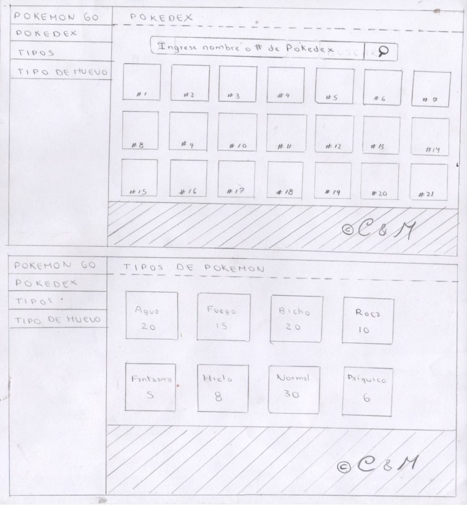
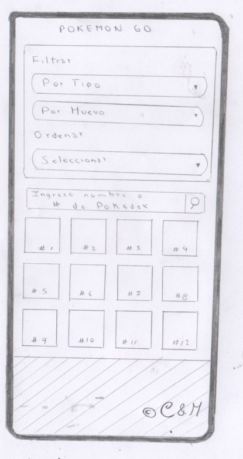
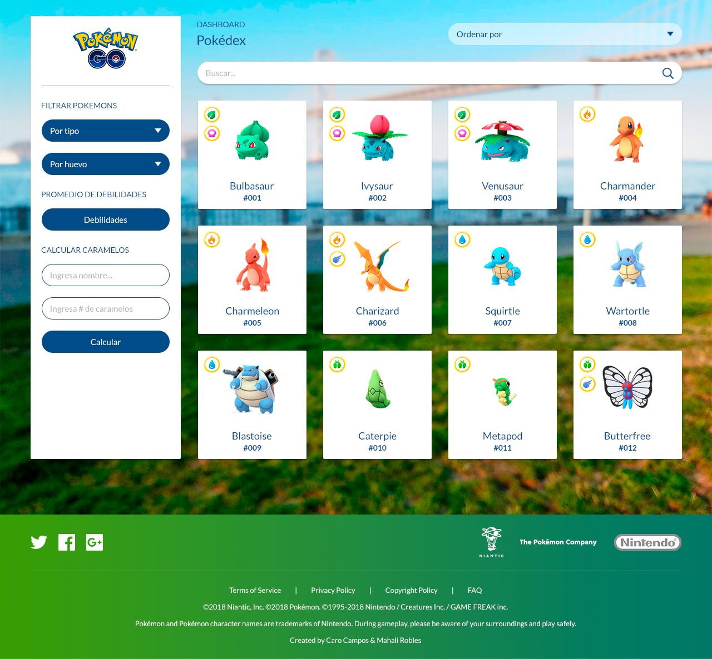
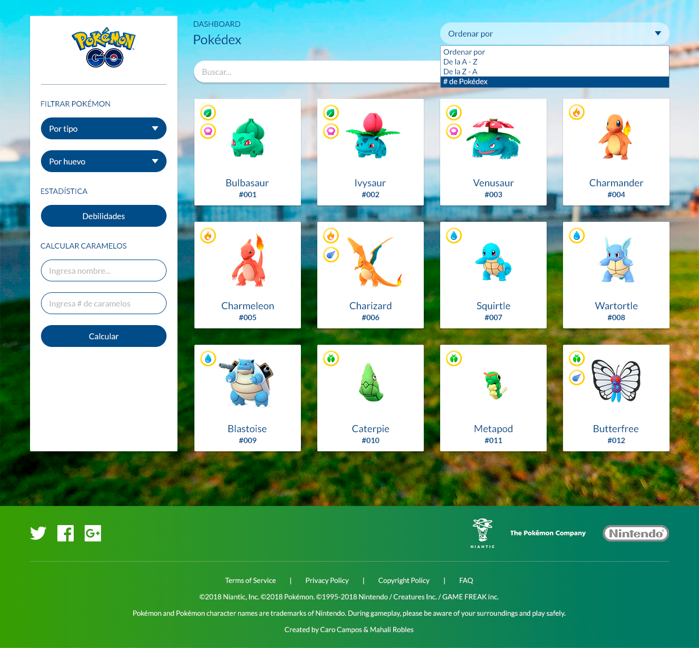
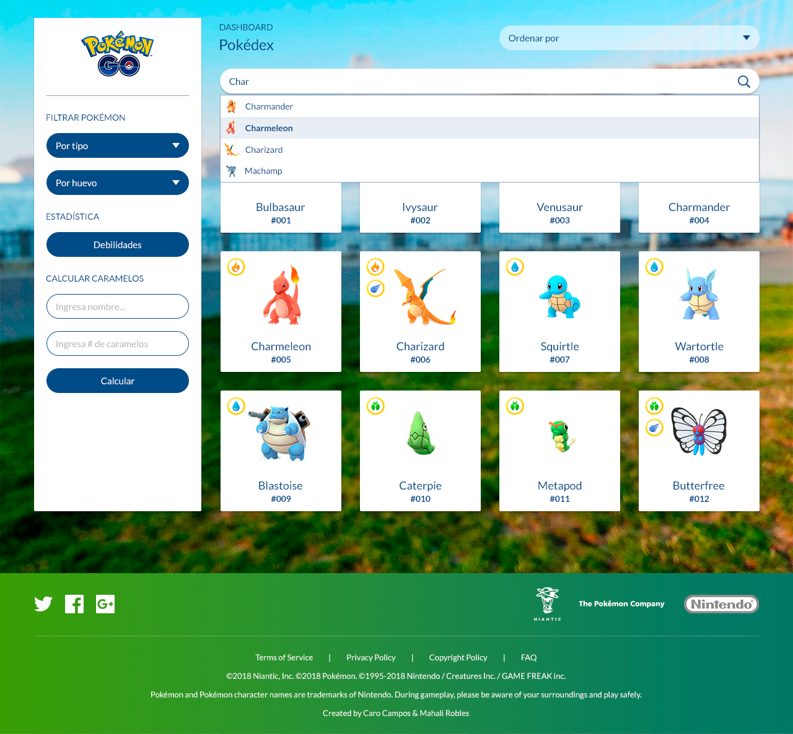
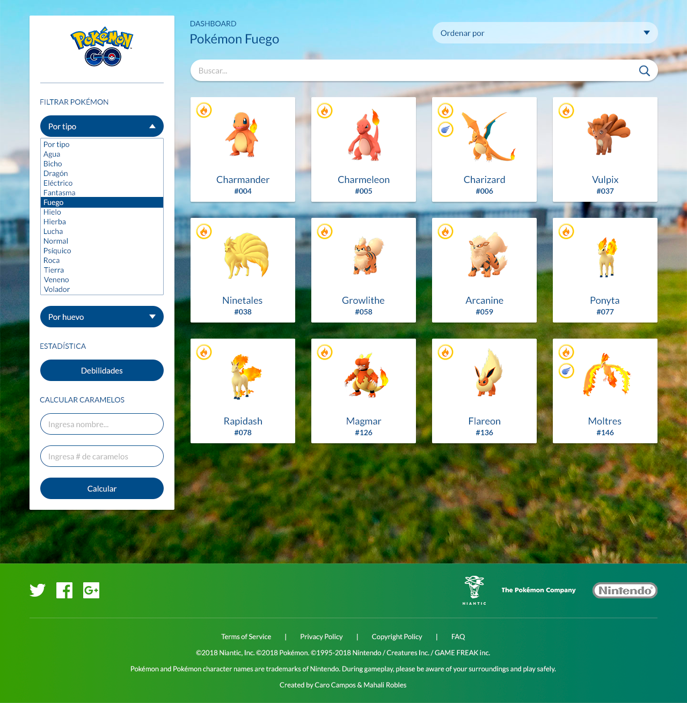
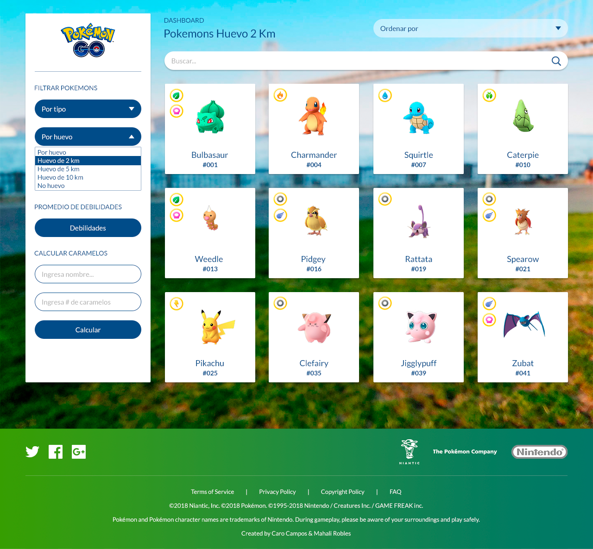
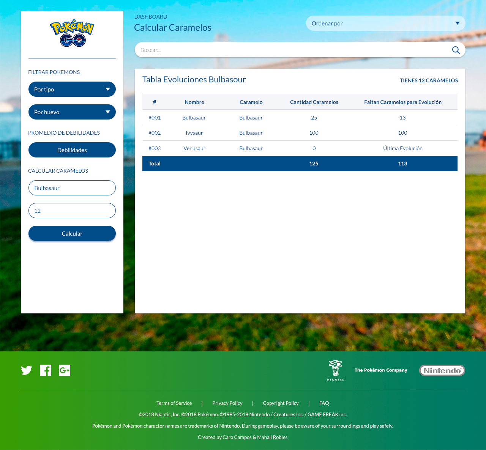
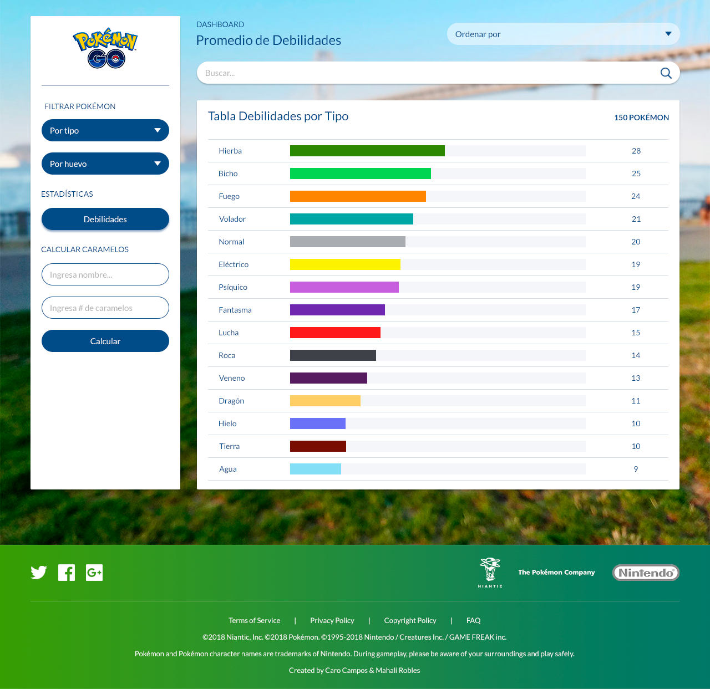

# POKÉMON GO

## Índice

* [Definición del producto](#Definición-del-producto)
* [Historias de usuario](#Historias-de-usuario)
* [Prototipo de baja fidelidad o Sketch](#Prototipo-de-baja-fidelidad-o-Sketch)
* [Prototipo de alta fidelidad o Diseño de la interfaz de usuario](#Prototipo-de-alta-fidelidad-o-Diseño-de-la-interfaz-de-usuario)
* [Test de usabilidad](#Test-de-usabilidad)

***

## Definición del producto

1. ¿Quiénes son los principales usuarios de producto?

Jugadores habituales de Pokémon Go.

2. ¿Cuáles son los objetivos de los usuarios?

Obtener información específica sobre los pokémon que se encuentran en el juego.

3. ¿Cuáles son los datos más relevantes que quieren ver en la interfaz y por qué?

- Tipos de pokémon.
- Que pokémon se puede obtener según el tipo de huevo.
- Cantidad de caramelos que se necesita para evolucionar un pokémon.
- Poder ordenar los pokémon según número de Pokédex.
- Poder ordenar los pokémon según orden alfabético de A-Z y Z-A.

4. ¿Cuándo utilizan o utilizarían el producto?

Cuando quieran obtener información de un pokémon en específico.

5. ¿Cómo fue el proceso de diseño?

-    Se eligió, con que data ibamos a trabajar, en este caso elegimos la data de Pokémon.
-    Se eligió quienes serán los principales usuarios del producto, para ello se procedió a revisar qué información tenía la data de Pokémon, cuando se revisó la data nos dimos cuenta que la información que tenía era sobre el juego Pokémon Go en específico, por ello se decidió que nuestros usuarios serían los jugadores de Pokémon Go. 
-    Se realizaron entrevistas a las personas que sean Jugadores de Pokémon Go, antes de realizar la entrevista, se le avisó a la persona que la entrevista sería grabada y que queríamos que nos explicara o nos hablara sobre qué información le parece importante o necesaria encontrar en una página web sobre el juego Pokémon Go.
-    Según las grabaciones de las entrevistas se realizaron las Historias de Usuario.
-    Se realizaron los prototipos de baja fidelidad según las Historias de Usuario.
-    Se realizaron los prototipos de alta fidelidad, tomando en cuenta los prototipos de baja fidelidad.

6. ¿Cómo crees que el producto resuelve el problema que tiene tu usuario?

El presente proyecto soluciona la necesidad del usuario de acceder fácilmente a informacion específica sobre los pokémon que se encuentran en el juego Pokémon Go.

## Historias de usuario

### Historia 1

COMO: Jugador de Pokémon Go.

QUIERO: Filtrar los pokémon según su tipo.

PARA: Saber que pokémon hay en cada tipo.

CRITERIOS DE ACEPTACIÓN

- La página debe permitir filtrar según el tipo de pokémon.
- La página debe mostrar a los pokémon según el tipo al que pertenezcan.
- El usuario debe poder seleccionar el tipo de pokémon que desea ver.
- Debe pasar Test unitario.
- Debe ser responsive.

### Historia 2

COMO: Jugador de Pokémon Go.

QUIERO: Filtrar los pokémon según el tipo de huevo.

PARA: Poder saber que pokémon puedo obtener según el tipo de huevo.

CRITERIOS DE ACEPTACIÓN

- La página debe permitir filtrar según el tipo de huevo.
- La página debe mostrar a los pokémon según el tipo de huevo al que pertenezcan.
- El usuario debe poder seleccionar el tipo de huevo que desea ver.
- Debe pasar Test unitario.
- Debe ser responsive.

### Historia 3

COMO: Jugador de Pokémon Go.

QUIERO: Ordenar a los pokémon según su número de Pokédex

PARA: Poder ubicarlo facilmente.

CRITERIOS DE ACEPTACIÓN

- La página debe permitir ordenar a los pokémon según el número de Pokédex.
- La página debe mostrar a los pokémon ordenados según el número de Pokédex.
- El usuario debe poder seleccionar la opción Ordenar según el número de Pokédex.
- Debe pasar Test unitario.
- Debe ser responsive.

### Historia 4

COMO: Jugador de Pokémon Go.

QUIERO: Ordenar a los pokémon según el orden alfabético de la A-Z.

PARA: Poder ubicarlo facilmente.

CRITERIOS DE ACEPTACIÓN

- La página debe permitir ordenar a los pokémon según el orden alfabético de la A-Z.
- La página debe mostrar a los pokémon ordenados según el orden alfabético de la A-Z.
- El usuario debe poder seleccionar la opción Ordenar a los pokémon según el orden alfabético de la A-Z.
- Debe pasar Test unitario.
- Debe ser responsive.

### Historia 5

COMO: Jugador de Pokémon Go.

QUIERO: Ordenar a los pokémon según el orden alfabético de la Z-A.

PARA: Poder ubicarlo facilmente.

CRITERIOS DE ACEPTACIÓN

- La página debe permitir ordenar a los pokémon según el orden alfabético de la Z-A.
- La página debe mostrar a los pokémon ordenados según el orden alfabético de la Z-A.
- El usuario debe poder seleccionar la opción Ordenar a los pokémon según el orden alfabético de la Z-A.
- Debe pasar Test unitario.
- Debe ser responsive.

### Historia 6

COMO: Jugador de Pokémon Go.

QUIERO: Calcular cuantos caramelos necesito para la evolución de mi pokémon.

PARA: Saber cuantos caramelos le falta para evolucionar y a que pokémon evoluciona.

CRITERIOS DE ACEPTACIÓN

- La página debe permitir ingresar el nombre del pokémon que desea evolucionar.
- La página debe permitir ingresar la cantidad de caramelos que el usuario tiene actualmente.
- La página debe permitir presionar un botón para realizar el cálculo.
- La página debe mostrar la cantidad de caramelos que le falta al pokémon para evolucionar.
- La página debe mostrar el nombre del pokémon al que va evolucionar.
- Debe pasar Test unitario.
- Debe ser responsive.

## Prototipo de baja fidelidad o Sketch

*PRIMER PROTOTIPO*: Versión móvil, tablet y escritorio

 

*SEGUNDO PROTOTIPO*: Versión móvil, tablet y escritorio

 
 
*TERCER PROTOTIPO*: Versión móvil(1) y Versión tablet y escritorio(2)

 

 

*CUARTO PROTOTIPO*: Versión móvil(1) y Versión tablet y escritorio(2)

 

 

*QUINTO PROTOTIPO*: Versión móvil(1) y Versión tablet y escritorio(2)

 

 

## Prototipo de alta fidelidad o Diseño de la interfaz de usuario

[Zeplin](https://zpl.io/VkwpyJ8)

*INICIO*

 

*SELECT ORDENAR*

 

*BUSCADOR*

 

*SELECT TIPO DE POKÉMON*

 

*SELECT TIPO DE HUEVO*

 

*CALCULAR CARAMELOS*

 

*ESTADÍSTICA DE DEBILIDADES*

 

## Test de usabilidad

Testeo de primer prototipo de baja fidelidad: 

- El usuario solicitó poder ver a los pokémon segun el tipo de pokémon y tipo de huevo.
- También comentó que era importante que aparezca el número de Pokédex en la imagen.

Testeo de segundo prototipo de baja fidelidad: 

- El usuario solicitó que al buscar al pokémon aparezca el cuadro de ese pokémon.
- Que también pueda presionar ese cuadro y aparezca todo el dato informativo del pokémon como se mostró en el primer prototipo. 
- También solicitó no solo poder buscar por nombre sino también por número de Pokédex. 
- El usuario solicitó que la forma de acceder a los tipos de pokémon sea diferente para Desktop.

Testeo de tercer prototipo de baja fidelidad:

- Fue a partir de este prototipo que se comenzó a trabajar en el primer sprint
- En el testeo el usuario pidió poder ordenar a los pokémon por # de Pokédex, de la A-Z y Z-A.
- Por último poder calcular la cantidad de caramelos que le faltaban a su pokémon.

